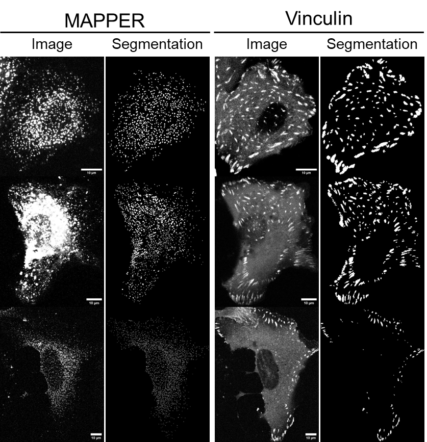

\# MCS\_FA Segmentation and Analysis


This repository contains the jupyter notebook and environment setup used for the MCS-FA project. 


\## Repository Contents


\- `FA-MAPPER analysis.ipynb` — reads in TIFF files, allows user to select cells, segments MCS puncta and focal adhesions.

\- `environment.yml` — conda/mamba environment specification for `FA-MAPPER analysis.ipynb`

\- `README.md`

\- `.gitignore`

\- `LICENCE`


\### Setting up the environment


```bash

# Recommended: create from the exported environment file

mamba env create -f environment.yml

# or with conda

conda env create -f environment.yml


# Activate the environment

conda activate devbio-napari-env


# Open Jupyter Lab

jupyter lab

```

\### Example input output of segmentation



